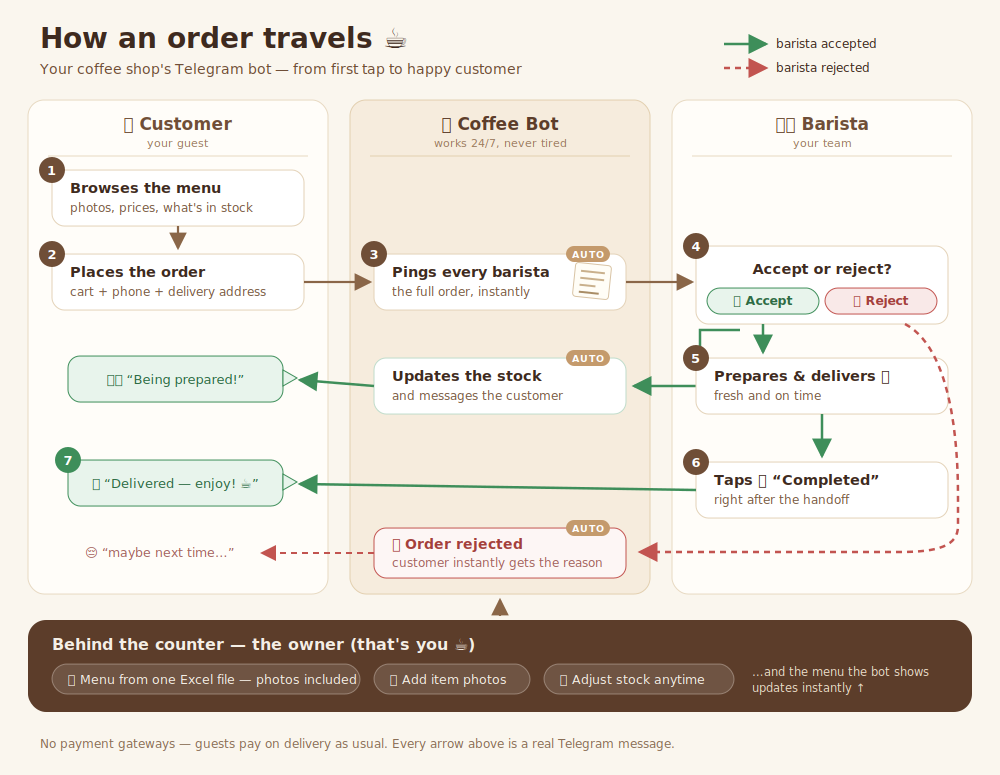
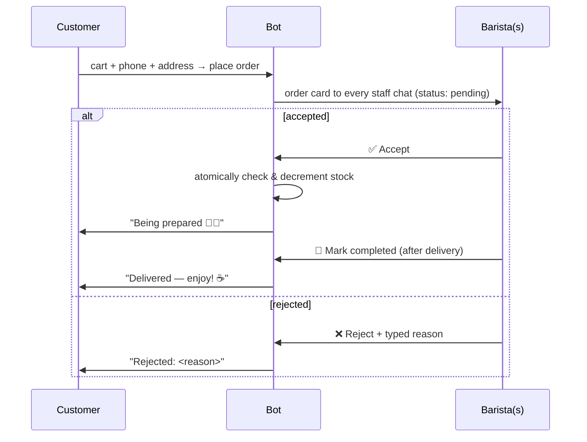

# ☕ Coffee Shop Delivery Bot for Telegram

A small, self-hosted Telegram bot for a local coffee shop. Customers browse a photo menu and order delivery; baristas accept, reject (with a reason) and complete orders; the owner manages the whole menu from a single Excel file. No payment gateways — guests pay on delivery as usual.

**How it works, in one picture** (made for the coffee shop owners — open [`docs/business_process_diagram.svg`](docs/business_process_diagram.svg) in any browser):



Tech: Python 3.12 · [python-telegram-bot](https://python-telegram-bot.org) v21 · SQLite · Docker · **webhooks** (with a Cloudflare tunnel for local testing, so local runs behave exactly like production).

---

## 1. Quick start (local, with real webhooks)

### Prerequisites

* **Docker** with the compose plugin — <https://docs.docker.com/get-docker/>
* **cloudflared** (Cloudflare's tunnel client, a single binary, no account needed) — <https://developers.cloudflare.com/cloudflare-one/connections/connect-networks/downloads/>
* A **Telegram bot token**:
  1. In Telegram, open [@BotFather](https://t.me/BotFather) → send `/newbot`.
  2. Pick a display name (e.g. *Bean There Coffee*) and a username ending in `bot`.
  3. Copy the token that looks like `123456789:AAH6k...`.

### Run it

```bash
cp .env.example .env
# edit .env → paste BOT_TOKEN, and put your Telegram ID into ADMIN_IDS
#   (get your ID from @userinfobot, or later via /myid in your own bot)

./scripts/dev_tunnel.sh
```

The script starts a free Cloudflare *quick tunnel* to your machine, writes the public `https://….trycloudflare.com` URL into `.env` as `WEBHOOK_URL`, and starts the bot with `docker compose up --build`. On boot the bot registers that URL with Telegram, so every message arrives as a **webhook call** — the same mechanism you'll use in production. `Ctrl+C` stops both the bot and the tunnel.

**On Windows?** Use the PowerShell version — same one command:

```powershell
Copy-Item .env.example .env   # then fill BOT_TOKEN + ADMIN_IDS
.\scripts\dev_tunnel.ps1
```

If PowerShell blocks the script, allow it for that session first with `Set-ExecutionPolicy -Scope Process -ExecutionPolicy Bypass`. You'll need **Docker Desktop** and **cloudflared** (`winget install --id Cloudflare.cloudflared`).

<details>
<summary>Doing it manually (any OS, or if you prefer two terminals)</summary>

```bash
# terminal 1 — tunnel; copy the https://xxx.trycloudflare.com URL it prints
cloudflared tunnel --url http://localhost:8080

# terminal 2 — paste that URL into .env as WEBHOOK_URL=..., then:
docker compose up --build
```

A quick tunnel gets a **new random URL each run** — re-paste it (both scripts automate exactly this). If you leave `WEBHOOK_URL` empty, the bot falls back to long polling, which is handy for a 30-second sanity check but isn't what we're simulating here.
</details>

### First-run checklist (2 minutes)

1. Open your bot in Telegram and press **/start**. Because your ID is in `ADMIN_IDS`, you're an admin already — `/admin` opens the panel.
2. Send the bot the included **`sample_menu.xlsx`** as a file. It imports 11 items and even pulls 3 photos that are embedded in the sheet.
3. Press `/menu` — browse as a customer, add something to the cart, checkout (it asks for phone + address once), place the order.
4. The order card pops up in your own chat (you're staff too). Press **✅ Accept**, then **🏁 Mark completed** — and watch the customer-side notifications arrive.

That's the whole loop from the diagram, end to end.

---

## 2. People & roles

| Role | Can do | How they get it |
|---|---|---|
| `customer` | browse, order, see own orders | everyone, automatically on /start |
| `barista` | + receive order cards, accept / reject / complete, `/queue` | promoted by an admin |
| `admin` | + `/admin` panel: Excel import, stock, photos, `/users`, `/setrole` | listed in `ADMIN_IDS`, or promoted |

Promoting a barista:

1. The barista opens the bot and presses **/start** (required — Telegram only lets bots message people who started them).
2. You run **/users** — every registered person is listed with their ID.
3. You run **/setrole <id> barista**. They're notified and start receiving order cards immediately.

`/setrole <id> admin` and `/setrole <id> customer` work the same way. Anyone can see their own ID with `/myid`.

> **Important:** orders are broadcast to everyone with the `barista` or `admin` role — make sure at least one staff account has pressed /start before opening for business.

## 3. The menu

### Import from Excel (the main way)

Send any `.xlsx` file to the bot (as an admin) — or go via `/admin → 📊 Import menu from Excel`. Use `sample_menu.xlsx` as the template. Expected header row, in any order, case-insensitive:

| Name | Category | Subcategory | Price | Quantity |
|---|---|---|---|---|
| Cappuccino | Drinks | Coffee | 4.50 | 40 |
| Croissant | Food | Snacks | 2.50 | 20 |

* **Category** must be `Drinks` or `Food`; **Subcategory** is free-form (Coffee, Tea, Beverages / Snacks, Desserts, Meals/Bowls…) and becomes a button in the menu automatically.
* **Price** is optional — leave the cell empty for "ask at the counter" pricing; totals are shown only when every item in an order has a price.
* **Photos:** paste images straight into the sheet, anchored to the item's row (the sample file shows how). On import the bot extracts and attaches them automatically. Keep the file under Telegram's 20 MB bot limit.
* Re-uploading the file **updates items by name** (stock, price, category) and **keeps existing photos**. Rows with problems are skipped and reported back to you, item by item.

### Photos without Excel

Two more ways, any time: send the bot a photo with the **exact item name as the caption**, or use `/admin → 🖼 Item photos`, pick the item (items missing a photo are marked ⬜), then send the picture.

### Stock & availability

`/admin → 🧾 Items & stock` → tap an item: `−10 −1 +1 +10` buttons, **Set exact stock**, **Hide/Show in menu** (e.g. seasonal items), or **Delete**. Stock is also reduced **automatically** when a barista accepts an order — see below. Items at 0 show as *sold out* to customers.

## 4. How orders flow (what the diagram shows)



Details worth knowing:

* **Stock is decremented at *accept* time, atomically.** If two baristas tap Accept at once, only the first wins (the other sees "already handled"). If stock ran out between ordering and accepting, the accept is refused with the exact shortage list and the order stays pending — restock via `/admin` or reject with a reason.
* Every staff member gets their own copy of the order card; when anyone acts on it, **all copies update** to the new status, so the team never double-handles an order.
* `/queue` re-sends all open (pending + accepted) orders — useful at shift start.
* Customers track their orders with `/myorders`.

## 5. Project layout

```
coffee-bot/
├── bot/
│   ├── main.py            # entry point: handlers + webhook/polling runner
│   ├── config.py          # env vars (token, webhook, admins, currency…)
│   ├── database.py        # SQLite schema + all queries (atomic accept logic)
│   ├── excel.py           # .xlsx parser incl. embedded-image extraction
│   ├── keyboards.py       # every inline keyboard + text formatting
│   └── handlers/
│       ├── common.py      # /start /help /myid /cancel, text router
│       ├── customer.py    # browse → cart → checkout → place order
│       ├── barista.py     # order cards, accept/reject/complete, /queue
│       └── admin.py       # panel, Excel import, stock, photos, roles
├── data/                  # SQLite lives here (mounted as a Docker volume)
├── docs/business_process_diagram.svg
├── scripts/dev_tunnel.sh  # local webhook run via Cloudflare quick tunnel (macOS/Linux/Git Bash/WSL)
├── scripts/dev_tunnel.ps1 # same, native PowerShell for Windows
├── scripts/make_sample_menu.py
├── tests/smoke.py         # offline sanity suite (no token needed)
├── sample_menu.xlsx
├── Dockerfile · docker-compose.yml · .env.example · requirements.txt
```

Run the test suite any time with `BOT_TOKEN=123:ABC python tests/smoke.py` (it uses a temp database and never touches the network).

## 6. Deploying to the internet

The bot is one container + one SQLite file, so it runs anywhere Docker runs. On boot it (re)registers its webhook automatically from `WEBHOOK_URL` (or auto-detects it on Render and Fly.io) — deploys are just "set env vars and start".

> **👉 For a full step-by-step deploy with free hosting + CI/CD on every GitHub push, see [DEPLOY.md](DEPLOY.md).** It uses Fly.io with a persistent volume (so your data survives restarts) and a GitHub Actions pipeline that tests then deploys. The quick notes below are a summary of the options.

> Hosting plans and free tiers change often (the notes below reflect early 2026) — double-check the provider's current docs.

### Option A — any small VPS (best for keeping your data)

Oracle Cloud's *Always Free* tier, a cheap DigitalOcean/Hetzner box, or a Raspberry Pi at the shop all work the same way:

```bash
git clone <your repo> && cd coffee-bot
cp .env.example .env        # fill BOT_TOKEN, ADMIN_IDS
# point WEBHOOK_URL at your domain or a *named* Cloudflare tunnel URL
docker compose up -d --build
```

Telegram requires HTTPS for webhooks. The two easy paths: a **named Cloudflare tunnel** (free, gives you a stable `https://bot.your-domain.com` without opening ports — perfect continuation of the local setup), or a reverse proxy such as Caddy with automatic certificates. The SQLite file persists in `./data/` — back it up by copying one file.

### Option B — Render free web service (zero servers)

1. Push this folder to a GitHub repo, then on [render.com](https://render.com): **New → Web Service →** your repo, runtime **Docker**.
2. Add environment variables: `BOT_TOKEN`, `ADMIN_IDS` (and `CURRENCY` if you like). You do **not** need `WEBHOOK_URL` or `PORT` — the bot auto-detects Render's `RENDER_EXTERNAL_URL` and injected `PORT`.
3. Deploy. Check the logs for `Webhook mode → https://your-app.onrender.com/...`.

Free-tier caveats to know about: the instance **sleeps after ~15 min idle** — the first message after a quiet spell takes ~30–60 s while it wakes (a free uptime pinger pointed at your URL works around it); and the **disk is ephemeral**, so the SQLite database is wiped on every deploy/restart. For a real shop on Render, either attach a persistent disk (paid feature) and set `DB_PATH` onto it, or treat Render as a demo stage and graduate to Option A. Other free-ish platforms (Koyeb, Fly.io, Railway) follow the same pattern: container + env vars + a public HTTPS URL.

## 7. Configuration reference

| Variable | Required | Meaning |
|---|---|---|
| `BOT_TOKEN` | ✅ | token from @BotFather |
| `ADMIN_IDS` | ✅ (recommended) | comma-separated Telegram IDs auto-promoted to admin on /start |
| `WEBHOOK_URL` | for webhook mode | public HTTPS base URL; empty → long-polling fallback. Render's `RENDER_EXTERNAL_URL` is picked up automatically |
| `PORT` | – | listen port, default `8080` (hosting platforms usually inject it) |
| `CURRENCY` | – | symbol shown next to prices, default `$` |
| `WEBHOOK_SECRET` | – | secret Telegram echoes back on each webhook call; auto-derived from the token if empty |
| `DB_PATH` | – | SQLite location, default `data/coffee.db` (compose maps it to `./data/`) |

The webhook listens on a non-guessable path derived from the token (not the token itself), and every incoming call is verified against `WEBHOOK_SECRET` — standard Telegram webhook hygiene, already wired up.

## 8. Troubleshooting

* **Bot doesn't react at all** → `docker compose logs -f bot`. Then ask Telegram what it thinks:
  ```bash
  curl "https://api.telegram.org/bot<BOT_TOKEN>/getWebhookInfo"
  ```
  `url` should match your tunnel/host; `last_error_message` usually names the problem (TLS, 404, connection refused…).
* **Tunnel URL changed** (quick tunnels rotate every run) → just rerun `./scripts/dev_tunnel.sh`; it rewrites `.env` and the bot re-registers the webhook on boot.
* **"No staff registered" in logs when an order arrives** → your barista/admin never pressed /start. Fix that, then `/queue` to resend open orders.
* **Excel import skipped rows** → the report message lists each row and why (bad category, non-numeric quantity…). Fix the cells and re-upload — items are matched by name, nothing duplicates.
* **Photos didn't import** → make sure images are *inserted into the sheet* (not linked), anchored on the item's row, and the file is < 20 MB. Worst case: send the photo with the item name as the caption.
* **Wiped menu/orders after a redeploy on Render free** → expected (ephemeral disk); see §6 Option B.

---

*Built as a compact, readable reference implementation — ~1,200 lines of Python, no framework magic. Fork away.* ☕
